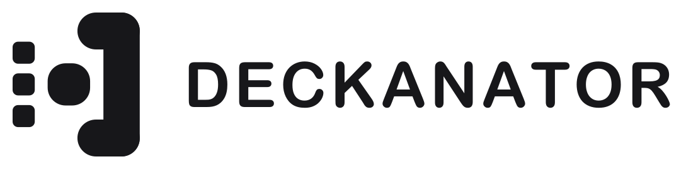

<p>
  <picture>
    <source media="(prefers-color-scheme: dark)" srcset=".github/readme/logo-dark.png">
    
  </picture>
  
</p>

The only controller-friendly Minecraft launcher for Steam Deck with modding support.


## Install on Steam Deck

Open a terminal in Desktop Mode (Konsole) and run:

```bash
curl -fsSL https://github.com/sedyh/deckanator/releases/latest/download/install.sh | bash
```

The script will:
1. Download and install the Deckanator Flatpak bundle
2. Download the installer binary and configure Steam integration:
   - Install icon to `~/.local/share/deckanator/`
   - Create `.desktop` entries for launch and uninstall
   - Add Deckanator to Steam with artwork (`shortcuts.vdf`)
   - Copy grid / poster / hero artwork (existing artwork is preserved)
   - Restart Steam automatically

Deckanator will appear in your Steam library after restart.

To install a specific version:

```bash
curl -fsSL https://github.com/sedyh/deckanator/releases/latest/download/install.sh | bash -s v1.0.0
```

## Uninstall

In Desktop Mode open the "Uninstall Deckanator" entry from the application menu, or run:

```bash
~/.local/share/deckanator/deckanator-installer --uninstall
```

This removes the binary, `.desktop` entries, and the Steam shortcut.

## Update

Re-run the install command - existing Steam artwork is preserved.

## Steam Artwork

Artwork is embedded in the installer binary from `cmd/installer/assets/`:

| File | Size | Usage |
|------|------|-------|
| `grid.png` | 920x430 | Library horizontal capsule |
| `poster.png` | 600x900 | Library vertical capsule |
| `hero.png` | 1920x620 | Game detail hero banner |
| `logo.png` | 1089x270 | Transparent logo overlaid on the hero |
| `icon.png` | 1024x1024 | Shortcut icon |

Vector masters live in `cmd/installer/assets/svg/`. Replace the PNG files before building the installer to use custom artwork. During install, existing artwork is never overwritten.

## Donate

TON - `UQAtK6y7S4kZNWVssNaoma3oD9WD0st7Nh2KmRRcXCHgaczd`

USDT TRC20 - `TDgzdVPub2tgUSvhhnLHoTagSpyhk7f179`

## Build

Requires [Go](https://go.dev) and [Wails](https://wails.io).

```bash
# Install tools
go install tool

# macOS
task build:mac

# Linux / Steam Deck
task build:linux
```
